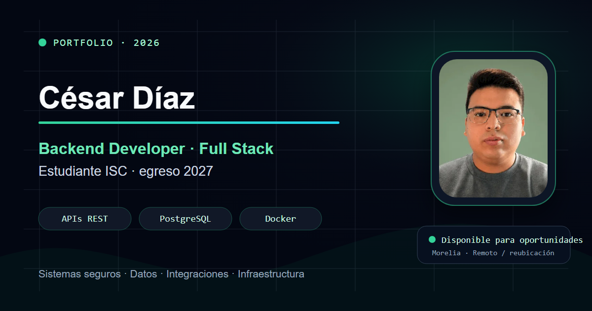
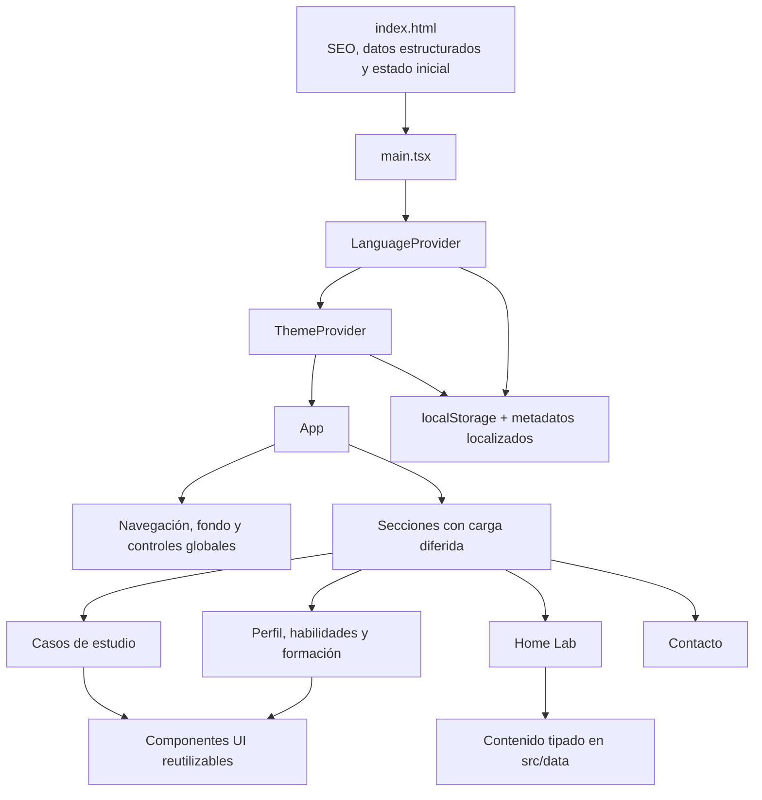

# Portafolio de César Díaz

Aplicación web de portafolio profesional de un **estudiante de Ingeniería en Sistemas Computacionales, con egreso estimado en 2027**, orientado a un perfil de **Backend Developer con capacidad Full Stack**. El sitio documenta experiencia técnica, proyectos, arquitectura de sistemas, infraestructura personal, formación y canales de contacto mediante una interfaz bilingüe y responsive.

[Ver aplicación desplegada](https://portfolio-xplq.vercel.app/)



## Descripción

El proyecto está construido como una Single Page Application con React y TypeScript. La información se organiza para priorizar evidencia técnica: casos de estudio, participación individual, resultados verificables, diagramas de arquitectura y recorridos funcionales.

La implementación no requiere servicios de backend ni variables de entorno para ejecutarse. El resultado de producción se genera como un conjunto de archivos estáticos compatible con Vercel y otros proveedores de hosting estático.

## Características principales

- Posicionamiento profesional centrado en desarrollo backend, datos, seguridad e integraciones.
- Casos de estudio con problema, contribución y resultado.
- Vistas interactivas de resultado, arquitectura backend y flujo funcional.
- Métricas técnicas contextualizadas y tecnologías prioritarias por proyecto.
- Selector de idioma español/inglés con persistencia en `localStorage`.
- Temas claro y oscuro con persistencia local.
- Navegación por secciones con indicador de progreso y sección activa.
- Componentes y secciones cargados de forma diferida mediante `React.lazy` y `Suspense`.
- Animaciones compatibles con `prefers-reduced-motion`.
- Diseño adaptativo para escritorio, tablet y dispositivos móviles.
- Metadatos SEO, Open Graph, Twitter Card y datos estructurados Schema.org.
- Imagen social propia de 1200 × 630 píxeles.
- Acceso directo al currículum en PDF y a los perfiles profesionales.

## Arquitectura de la aplicación



### Decisiones técnicas

- **React Context** administra idioma y tema sin introducir una biblioteca global de estado.
- **Carga diferida por sección** reduce el JavaScript necesario durante el primer renderizado.
- **Registro central de secciones** mantiene sincronizados el orden del contenido, la navegación y los indicadores laterales.
- **Componentes de presentación reutilizables** concentran comportamientos como revelado, efecto magnético, tarjetas con iluminación, imágenes y badges tecnológicos.
- **Contenido bilingüe tipado** evita mantener dos árboles de componentes independientes.
- **Persistencia local** conserva las preferencias de idioma y tema entre sesiones.
- **Renderizado inicial preventivo** aplica las preferencias guardadas antes de montar React para reducir cambios visuales durante la carga.
- **Accesibilidad de movimiento** desactiva o simplifica animaciones cuando el sistema solicita movimiento reducido.

## Stack técnico

| Área | Tecnología | Responsabilidad |
|---|---|---|
| Interfaz | React 19 | Composición de componentes y estado interactivo |
| Lenguaje | TypeScript 5 | Tipado estático y validación durante el build |
| Compilación | Vite 7 | Servidor de desarrollo y bundle de producción |
| Estilos | Tailwind CSS 4 | Sistema visual y diseño responsive |
| Animación | Motion 13 | Transiciones, presencia y animaciones basadas en scroll |
| Scroll | Lenis | Desplazamiento suavizado |
| Iconografía | React Icons 5 | Iconos de interfaz y tecnologías |
| Calidad | ESLint 9 | Análisis estático del código |

## Casos de estudio incluidos

### Kuni

Sistema de monitoreo remoto para enfermedades crónicas desarrollado durante Innovation Fest 2026. El caso documenta persistencia con PostgreSQL y RLS, recordatorios mediante una cola de salida, integración con WhatsApp/SMS y procesamiento de webhooks firmados.

- Rol presentado: backend e integraciones.
- Evidencia resumida: 20 tablas, 6 vistas SQL y recorrido end-to-end.
- Repositorio: [Cesaredmyt/Kuni](https://github.com/Cesaredmyt/Kuni)

### IMPA — Plataforma de Adopciones

Aplicación para centralizar adopciones, citas, esterilizaciones y reportes de bienestar animal mediante autenticación JWT y control de acceso basado en roles.

- Rol presentado: Backend Lead en un equipo de cuatro integrantes.
- Áreas destacadas: arquitectura, modelo relacional, JWT/RBAC e integración con frontend.
- Repositorio: [Cesaredmyt/Adopciones-IMPA](https://github.com/Cesaredmyt/Adopciones-IMPA)

### Detección de Fraude y Phishing

Pipeline reproducible desarrollado bajo la metodología CRISP-DM para comparar modelos supervisados, no supervisados y una línea base de reglas sobre datasets públicos.

- PaySim: 6,362,620 registros.
- Test final de PaySim: F1 0.9976 y AUC-PR 0.9995.
- Los resultados se presentan como evaluación experimental sobre datos públicos; no representan rendimiento bancario en producción.
- Repositorio: [Cesaredmyt/fraud-detection-itm](https://github.com/Cesaredmyt/fraud-detection-itm)

También se incluyen ProjeXus, Aquamarine Resort y Biblioteca Digital como antecedentes de desarrollo backend, full stack y modelado de datos.

## Estructura del repositorio

```text
portfolio/
├── public/
│   ├── img/                     # Capturas, avatar e identidad visual
│   ├── cv.pdf                   # Currículum descargable
│   ├── og-card.png              # Imagen Open Graph
│   └── og-card.svg              # Fuente vectorial de la imagen social
├── src/
│   ├── components/
│   │   ├── ui/                  # Componentes visuales reutilizables
│   │   ├── About.tsx            # Perfil y trayectoria
│   │   ├── Contact.tsx          # Canales de contacto
│   │   ├── Education.tsx        # Formación y certificaciones
│   │   ├── header.tsx           # Hero, propuesta profesional y métricas
│   │   ├── HomeLab.tsx          # Infraestructura y seguridad
│   │   ├── Nav.tsx              # Navegación, idioma y tema
│   │   ├── projects.tsx         # Casos, arquitecturas y flujos
│   │   ├── Skills.tsx           # Capacidades técnicas
│   │   └── Starfield.tsx        # Fondo interactivo
│   ├── context/
│   │   ├── LanguageContext.tsx  # Idioma, persistencia y metadatos
│   │   └── ThemeContext.tsx     # Tema claro/oscuro
│   ├── data/
│   │   ├── homelab.ts           # Contenido tipado de infraestructura
│   │   └── sections.ts          # Orden y etiquetas de navegación
│   ├── hooks/
│   │   └── useActiveSection.ts  # Detección de la sección activa
│   ├── App.tsx                  # Composición principal y lazy loading
│   ├── index.css                # Estilos globales y animaciones
│   └── main.tsx                 # Punto de entrada y providers
├── eslint.config.js
├── index.html                   # Metadatos, JSON-LD y shell inicial
├── package.json
├── tailwind.config.js
├── tsconfig.json
└── vite.config.ts
```

## Ejecución local

### Requisitos

- Node.js compatible con Vite 7.
- npm.
- Git, únicamente si el repositorio se obtiene mediante clonación.

### Instalación

```bash
git clone https://github.com/Cesaredmyt/portfolio.git
cd portfolio
npm ci
```

### Servidor de desarrollo

```bash
npm run dev
```

La aplicación queda disponible normalmente en `http://localhost:5173`.

## Comandos disponibles

| Comando | Descripción |
|---|---|
| `npm run dev` | Inicia el servidor de desarrollo con HMR |
| `npm run build` | Ejecuta `tsc -b` y genera el bundle de producción |
| `npm run lint` | Analiza el proyecto con ESLint |
| `npm run preview` | Sirve localmente el contenido generado en `dist/` |

## Validación y calidad

Antes de publicar cambios se recomienda ejecutar:

```bash
npm run lint
npm run build
```

El proceso de build incluye la comprobación de TypeScript. Los recursos de producción se generan en `dist/` y no deben editarse manualmente.

## Internacionalización

La interfaz mantiene una versión completa en español e inglés sin depender de un servicio externo de traducción.

- Idioma predeterminado: español.
- Clave de persistencia: `portfolio-language`.
- Valores permitidos: `es` y `en`.
- El selector actualiza el contenido, el atributo `lang` del documento y los metadatos principales.

## Temas visuales

El tema se controla mediante el atributo `data-theme` del elemento raíz.

- Clave de persistencia: `portfolio-theme`.
- Valores permitidos: `dark` y `light`.
- La preferencia almacenada se aplica desde `index.html` antes del montaje de React.

## SEO y apariencia al compartir

La configuración inicial se encuentra en `index.html` e incluye:

- Título y descripción orientados al posicionamiento backend.
- URL canónica.
- Open Graph y Twitter Card con imagen de 1200 × 630 píxeles.
- Datos estructurados `Person` mediante JSON-LD.
- Metadatos localizados al cambiar el idioma.
- Instrucciones de indexación para motores de búsqueda.

## Actualización de contenido

| Contenido | Ubicación principal |
|---|---|
| Casos de estudio y métricas | `src/components/projects.tsx` |
| Propuesta profesional | `src/components/header.tsx` |
| Habilidades | `src/components/Skills.tsx` |
| Home Lab | `src/data/homelab.ts` |
| Orden de navegación | `src/data/sections.ts` |
| SEO inicial | `index.html` |
| Textos y metadatos bilingües | Componentes y `src/context/LanguageContext.tsx` |

Las métricas deben conservar su contexto, fuente y conjunto de evaluación. No se recomienda incorporar porcentajes o cifras que no puedan rastrearse hasta documentación o resultados reproducibles.

## Despliegue

```bash
npm run build
```

El directorio `dist/` resultante puede publicarse en Vercel, Netlify, Cloudflare Pages o cualquier servidor de archivos estáticos configurado para servir el proyecto desde la raíz. La versión pública indicada en este documento utiliza Vercel.

## Contacto

- Correo: [dcesar664@gmail.com](mailto:dcesar664@gmail.com)
- LinkedIn: [linkedin.com/in/cesarenriquediazmaldonado](https://linkedin.com/in/cesarenriquediazmaldonado)
- GitHub: [github.com/Cesaredmyt](https://github.com/Cesaredmyt)
- Ubicación: Morelia, Michoacán, México

---

© 2026 César Enrique Díaz Maldonado.
